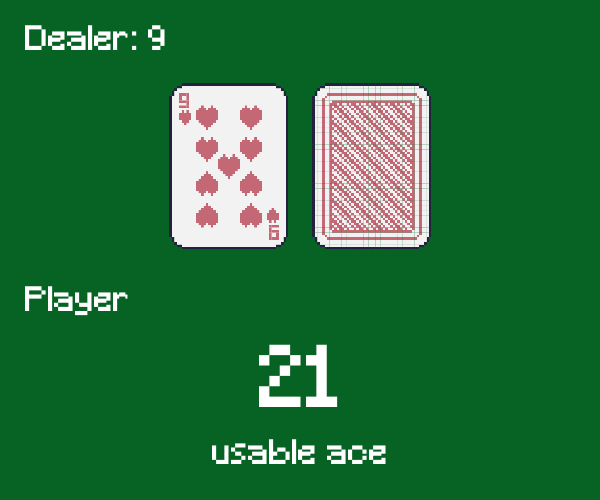
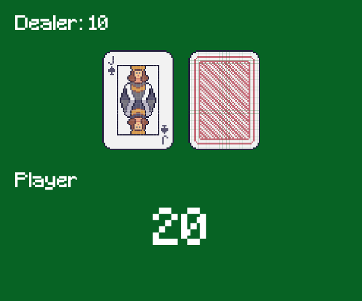
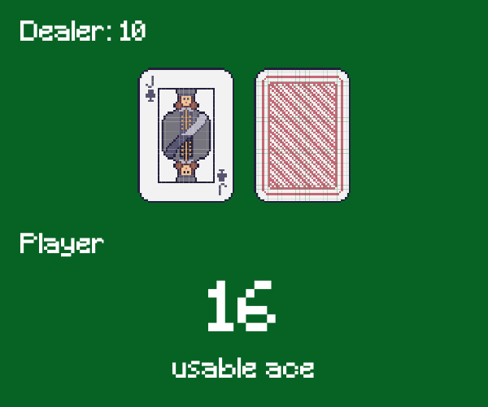

# BlackJack ♠️♦️♣️♥️🃏🤖
Here is a solution using QLearning to "solve" the BlackJack task.

## Context
This task needs a player to win over a dealer at BlackJack, this situation is a particular one in reinforcment learning because of its impredictability ; therefore we'll try to use QLearning to see what can be made.

## Spoiler about the task

  
Only reveal if you are ready to read it...

  At the beginning, the word solve was surrounded by '"', because we can't really solve the blackjack task.  
  Because this task mostly rely on randomness about the card that is taken by the player or the dealer, and because we don't know the distribution of the cards.
  Having 12 n your hands can be pretty safe until you get a 10, that are case that we can't predict and so lead the agent toward error.

  That's why the agent will learn what's the most likely strategies using the current number but will somehow fail, it's impossible to achieve a high win rate.

  To conclude, it is normal to have a win rate of 30%, 40%...It's randomness, not a mistake or an error.

## Result

With a learning rate of 0.9, discount of 0.99, epsilon of 1.0, max-steps of 200 and number of 200000 episodes, here is the result : 

| Random case 1 | Random case 2 | Random case 3 |
|------------|------------|------------|
|  |  |  |