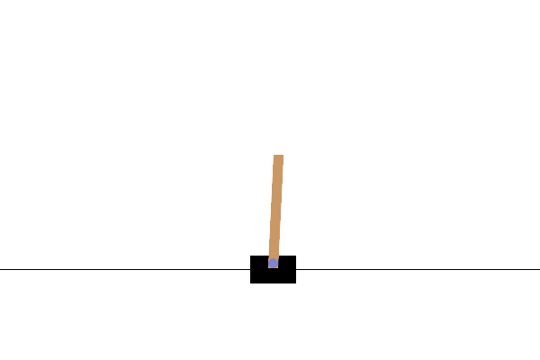

# Cart Pole 🛒🚩🤖
Here are solutions to solve the Cart Pole task.
There will be 3 variant of a the solution : 
- DeepQ Learning without replay memory
- DeepQ Learning with replay memory
- Double DeepQ Learning with replay memory.

It can be used to depict the progressiv adding of elements to solve problems of the precedent variant.

## Context
This task requires to balance a pole attached to cart that can only go left or right, the longer the pole is balanced the better it is.

## Result
Example of a result :

| Random Case |
| ------- |
|  |

