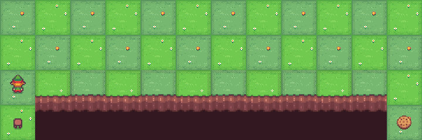

# Cliff Walking QLearning 🚶🍪🤖

Here is a solution using QLearning to solve the Cliff Walking task.

## Context
This task is even simpler than the Taxi one, it as the same level as the Frozen Lake, you need to bring someone to a destination (a cookie) without him falling into the cliff, because the board is quite small and always the same, it is a perfect task for the QLearning algorithm.

## Training time
1.1 seconds (GPU : no GPU - CPU : Intel i7 10th gen)

## Result

With a learning rate of 0.9, a discount of 0.8, an epsilon of 1.0, a max step of 99 and 1000 episode, here is the result :

| Result | 
| ------- |
|  |

