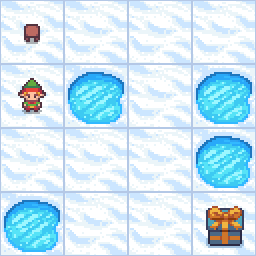

# Frozen Lake QLearning (not slippery) 🏔️🥶🤖

# Context
When solving the Frozen Lake with is_slippery on False, it is very similar to the Taxi task, as their are obstacles on the ground to avoid, their is a beginning point and a destination.

# Result

With a learning rate of 0.9, discount of 0.9, epsilon of 1.0, max-steps of 100 and number of 10000 episodes, here is the result : 

