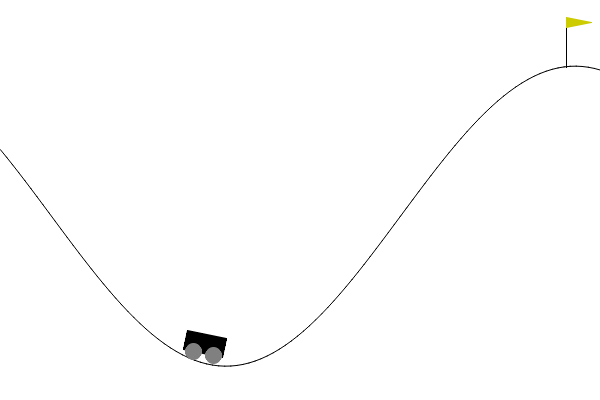
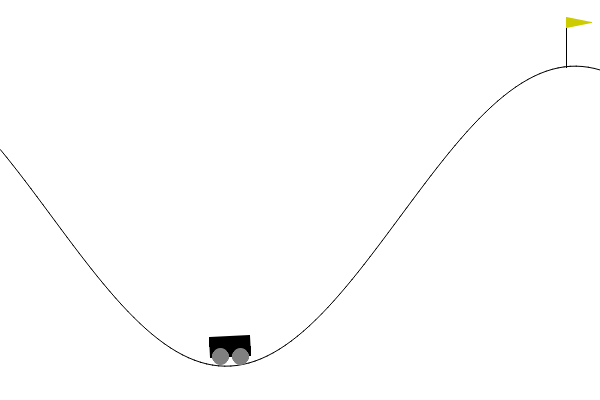

# Mountain Car (DeepQ Learning with Replay Memory) 🛒🗻🤖🧠
Here is a solution using simple DeepQ Learning with a replay memory to solve the Mountain Car task.

## Context
In the precedent solution we used a QLearning algorithm by turning the observation space from continuous to discrete. Here we let the observation space as it is, and use a neural network to estimate QValues instead of storing it in a table.

Here I describe how to achieve such a solution.

## Training time
Nearly 2 hours (GPU : no GPU - CPU : Intel i7 10th gen)

## Result
With a learning rate of 0.01, discount of 0.99, epsilon of 1.0, max steps of 200, 400 episodes, and a batch size of 256, here are the results : 

| Random case 1 | Random case 2 |
|------------|------------|
|  |   |