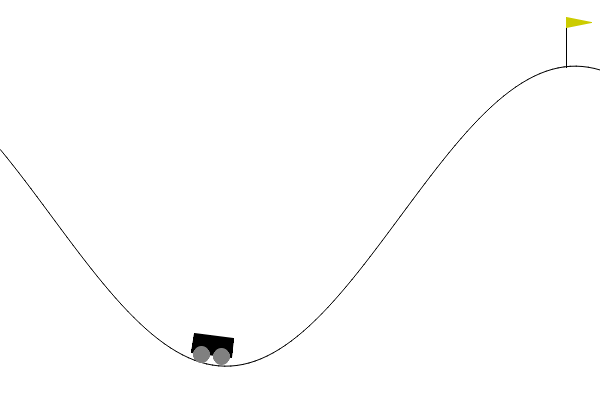

# Mountain Car
Here is a solution uing QLearning to solve the Mountain Car task.

## Context
This task that needs a cart to get at the top of the cliff, is quite complex. It's one of the first problem you encounter when facing continuous dimensions, one way to solve this task would be to use Deep QLearning, but here to keep things simple I'll try to show a QLearning solution by turning the continuous observation space into a discret one.

Here I descrie how to achieve such a solution.

## Result

With a learning rate of 0.9, max-steps of 500 and number of 10 000 episodes, here is the result : 

