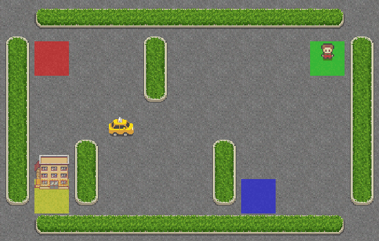

# Reinforcement Learning Solutions (OpenAI Gym)

## Context

This repository contains various solutions that I have found for different reinforcement learning problems using OpenAI Gym.

It's also a way for me to learn and improve in reinforcment learning, as I am trying to propose easy solutions to tasks.

## Structure

This repository is organized into different directories, each representing a specific reinforcement learning problem. Within each directory, you can find the solution code or a subdirectory implemnting a solution using a given alogrithm (example of the mountain car that can be solved using QLearning and DeepQ Learning).

*An explanation about the task and what will be done and the notebook that can be executed right away*

## Getting Started

There's not much to do, I tried to things simple as I can with any of the solutions in this repository, just download the Notebook, make sure you have all the dependencies/libraries and execute the code.

### QLearning
| Taxi Car | FrozenLake | Moutain Car |
| ---------- | ---------- | ---------- |
|  |  |  |

### DeepQLearning (currently in progress)
| Cart Pole | Pendulum | ??? |
| ---------- | ---------- | ---------- |
|  |  |  |

### DeepQLearning with images (TBA)
| ??? | ??? | ??? |
| ---------- | ---------- | ---------- |
| ??? | ??? | ??? |

## Contributions

Contributions to this repository are welcome! If you have found a new solution or have improvements for an existing one, feel free to submit a pull request or to contact me !
It's a cool way to learn new things or/and to get better !

